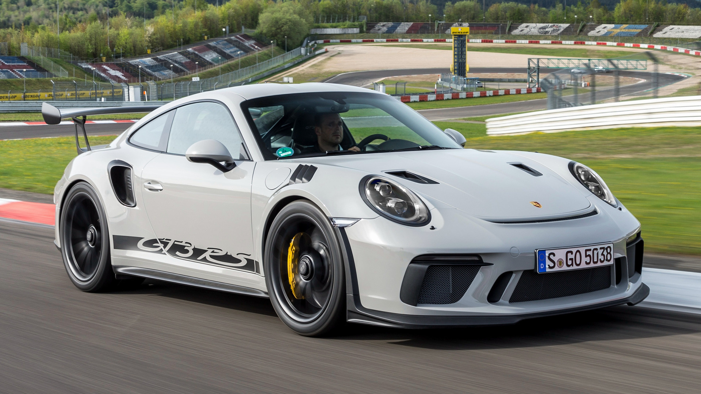
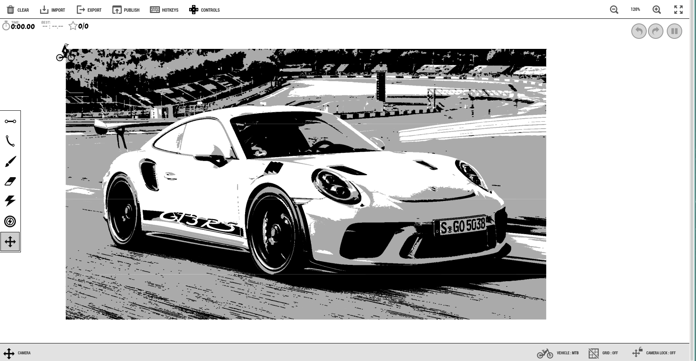

# Image to Free Rider HD Track Code


## Screenshots
<div style="display: flex; justify-content: space-around;">
    
    
</div>

The resulting output is 976KB for this particular image, the source was a 4k 744KB image. Using higher resoltion images with this program rarely has tangible benefits other than the size of the output being larger.


## Description
This is a simple program to take an image, convert it to grayscale, then threshold it based on 3 colors; gray, white and black, and encode the pixel data for gray and black to their appropriate line types in free rider hd.

It works by iterating (as mentioned) over rows and pixels in those rows, and performs a neighbour-based search similar to that of Run-Length Encoding algorithms (RLE); repeated pixels are pruned in order to save space in the output track. This is applicable in this case as the encoding method that free rider uses is based on simple coordinate-based lines, and hence pixel information between two points is not necessary.

In a previous (non-published) implementation of mine, I did not use a RLE or similar algorithm, and hence the resulting filesize and execution time was roughly 95 times more inefficient as compared to this solution. By no means do I claim to have invented this particular algorithm, and there is probably much room for improvement in optimising my code.

Future versions will see better stability and features, but as this is a personal/side project don't expect production level code or management. Feel free to comment and contribute, any help is appreciated.


## Features

- Convert various image formats (e.g., PNG, JPEG) to Free Rider HD track codes.
- Adjustable parameters for track generation (e.g., color thresholding, compression level (WIP)).

## Requirements

- C++11 or later
- [OpenCV](https://opencv.org/) (for image processing)
- A C++ compiler (e.g., g++, clang++)

## Installation

1. Clone the repository:

   ```bash
   git clone https://github.com/sub-arctic/frhd_gen
   cd frhd_gen
   mkdir build && cd build
   cmake .. && make

## Running

```bash
./image2track --input ~/path/to/image.png 
```
- Optional flags:
    - `--output`: sets the path for the track output. Defaults to terminal output
    - `--verbose`: adds some more verbose logging, including track size checking

## Disclaimer
I am in no way responsible for the usage and utilization of this tool. By using this tool, you agree to use it in a responsible manner with good intent. Any created works that violate free rider hd's terms of service are not endorsed or encouraged by me. Please use this tool ethically and responsibly.
